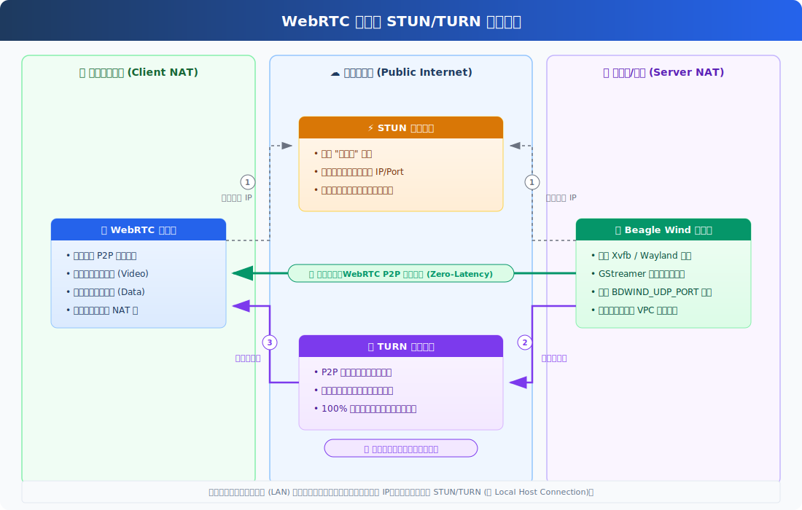

# Beagle Wind Desktop (VNC)

Beagle Wind 是一款基于 WebRTC、GStreamer 1.28 以及硬件加速 (NVENC) 的超低延迟云桌面推流系统。它能够通过浏览器为您提供原生主机般的流畅桌面体验。

## 🏛 核心架构分支介绍

为了满足不同的业务场景，Beagle Wind 提供了三种底层显示服务器与渲染架构，您可根据应用场景选择不同的镜像版本：

### 1. EGL 架构 (通用云桌面/高密度多开)

- **底层技术**：`Xvfb` (虚拟帧缓冲) + `VirtualGL` (EGL 硬件加速注入)
- **屏幕采集**：`ximagesrc` (共享内存采集)
- **适用场景**：日常办公、标准云桌面、需要在单台宿主机上**同时运行多个**桌面实例（高密度部署）。
- **优势**：兼容性极佳，不依赖物理显示器输出，不受 NVIDIA NVFBC 授权限制。

### 2. GLX 架构 (云游戏/高性能渲染)

- **底层技术**：真实 `Xorg` 服务器 + GPU 直连输出
- **屏幕采集**：`nvfbcsrc` (NVIDIA 零拷贝帧缓冲捕获)
- **适用场景**：大型 3D 云游戏、高帧率要求的专业渲染环境。
- **优势**：延迟极低，画面捕获完全在 GPU 显存内流转（Zero-Copy），性能损耗降至极限。

### 3. Hyprland 架构 (下一代/开发中 🚧)

- **底层技术**：纯正 `Wayland` 生态
- **适用场景**：追求极致现代化、极简主义与纯净渲染链路的高级玩家。
- **优势**：彻底摒弃历史包袱沉重的 X11 协议，带来丝滑的平铺窗口管理体验及更高的安全与性能上限。

---

## 🚀 快速开始

以下是一个标准的 **EGL 架构** 启动模板。此模板使用 Docker 桥接模式（Bridge），确保在一台机器上运行多个容器时不会发生端口冲突。

```bash
docker run -d \
  --name vnc-desktop-1 \
  --hostname beagle-desktop \
  --security-opt seccomp=unconfined \
  --security-opt apparmor=unconfined \
  --security-opt no-new-privileges=false \
  --cap-add=SYS_RAWIO \
  --shm-size=4g \
  --device /dev/uinput:/dev/uinput \
  --device nvidia.com/gpu=0 \
  -v /data/my-desktop:/home/beagle \
  -e BDWIND_PASSWORD=YourSecretPassword123 \
  -e BDWIND_UDP_PORT_MIN=59010 \
  -e BDWIND_UDP_PORT_MAX=59019 \
  -e NVIDIA_DRIVER_CAPABILITIES=all \
  -e VGL_DISPLAY=/dev/dri/card0 \
  -p 48080:8080 \
  -p 59010-59019:59010-59019/udp \
  registry.cn-qingdao.aliyuncs.com/wod/beagle-wind-vnc:1.0.14
```

> **访问方式**：容器启动后，在浏览器中打开 `http://<您的服务器IP>:48080`，输入 `BDWIND_PASSWORD` 的密码即可登入桌面！

---

## ⚙️ 核心环境变量 (BDWIND\_\*)

您可以通过在 `docker run` 中传递 `-e` 环境变量来高度定制您的云桌面系统：

### 基础设置

| 参数                  | 说明                                    | 默认值  |
| :-------------------- | :-------------------------------------- | :------ |
| `BDWIND_PASSWORD`     | WebUI 登录密码及 Basic Auth 验证密码    | _必填_  |
| `BDWIND_ENABLE_DEBUG` | 开启详细的 GStreamer 和 WebRTC 调试日志 | `false` |

### 编码与推流

> **💡 提示**：以下所有编码与推流参数**均为可选项**。这些仅作为后端的默认初始值，前端 Web 界面中的动态设置优先级更高，随时可实时覆盖。

| 参数                   | 说明                                 | 默认值      |
| :--------------------- | :----------------------------------- | :---------- |
| `BDWIND_ENCODER`       | 视频编码器（详见下方编码器优劣对比） | `nvh264enc` |
| `BDWIND_FRAMERATE`     | 目标推流帧率 (建议 `60` 或 `120`)    | `60`        |
| `BDWIND_VIDEO_BITRATE` | 视频最大码率 (kbps)                  | `10000`     |
| `BDWIND_AUDIO_BITRATE` | 音频码率 (bps)                       | `24000`     |

#### 📺 视频分辨率与码流配置教学 (新手必读)

Beagle Wind 的核心亮点是**支持在前端网页随时随地动态切换分辨率**（自动适配带鱼屏/手机端等各种比例），底层 GStreamer 会触发**无需重启的硬件级无缝拉伸**。

很多新手对“多大的分辨率需要配多大的码流”毫无概念。如果码流设低了，画面一动就满屏马赛克；设高了，外网又会疯狂丢包卡顿。请严格对照下表，配置您的 `BDWIND_VIDEO_BITRATE`（单位：kbps，即 10000 = 10Mbps）：

| 目标分辨率 (前端选定) | 画质需求 | 推荐码流 (H.264) | 推荐码流 (H.265 / AV1) | 适用场景说明                                  |
| :-------------------- | :------- | :--------------- | :--------------------- | :-------------------------------------------- |
| **720p** (1280x720)   | 流畅     | `4000 - 6000`    | `2500 - 4000`          | 手机端 4G 移动网络、弱网环境下的远程运维。    |
| **1080p** (1920x1080) | 高清办公 | `10000 - 15000`  | `6000 - 10000`         | **最主流配置**。日常写代码、看视频完全不糊。  |
| **1080p** (1920x1080) | 电竞游戏 | `20000 - 30000`  | `15000 - 20000`        | 配合 `120fps` 高帧率，打 3A 游戏大作不拖影。  |
| **2K** (2560x1440)    | 蓝光超清 | `25000 - 40000`  | `15000 - 25000`        | 适合大尺寸高分屏，对文字边缘锐利度要求极高。  |
| **4K** (3840x2160)    | 极致视觉 | `50000 - 80000`  | `35000 - 50000`        | 影视剪辑、3D 建模（仅推荐在内网局域网使用）。 |

> ⚠️ **避坑指南**：
> `BDWIND_VIDEO_BITRATE` 只是一个**上限阀门**。WebRTC 自带网络探测功能，网络变差时会在此上限内**自动降码保流畅**。但是！如果您的物理上行带宽根本不够（比如家里只有 5Mbps 的小水管），千万别硬着头皮把码率写成 `20000` 强推 2K 画质，那必然会导致严重的 UDP 报文堆积和巨量延迟！有多少网，吃多少饭。

#### 🎬 视频编码器全矩阵支持列表与优劣对比

Beagle Wind 依托 GStreamer 实现了极其丰富的编码器阵列，您可根据宿主机的硬件（NVIDIA/Intel/AMD）与网络条件进行自由配置：

##### 🟢 NVIDIA GPU 硬件编码 (NVENC 阵营)

专为搭载 NVIDIA 独立显卡（如 RTX/GTX/Tesla/Quadro）的宿主机设计，实现零拷贝、超低延迟的电竞级推流。

- **`nvh264enc` / `nvcudah264enc` (H.264 - 默认推荐)**
  - **优势**：**兼容性无敌**。能被地球上几乎所有的浏览器（Chrome/Safari/移动端等）硬件解码。
  - **劣势**：压缩率中规中矩，4K 极限画质下较吃带宽。
- **`nvh265enc` / `nvcudah265enc` (H.265 / HEVC)**
  - **优势**：**画质与带宽的完美平衡**。同等带宽下画质远超 H.264。
  - **劣势**：**挑客户端**。依赖客户端原生支持 HEVC 硬解（如 Apple 设备，或魔改版 Chrome），不支持则会黑屏。
- **`nvav1enc` (AV1 新时代编码)**
  - **优势**：**次世代王者**。免专利费，压缩率极高，画质甚至超越 H.265。
  - **劣势**：极挑硬件。仅限 NVIDIA RTX 40 系或更新架构（Ada Lovelace）显卡支持编码；客户端也需要较新的硬件才能解码。

##### 🔵 Intel / AMD 集显及独显硬件编码 (VAAPI 阵营)

针对无 NVIDIA 显卡，但有核显（Intel Core/AMD Ryzen）或 AMD 独显的宿主机环境。

- **`vah264enc` (VAAPI H.264)**：兼容性最好的核显推流方案。
- **`vah265enc` (VAAPI H.265)**：核显高画质方案（需客户端支持）。
- **`vavp9enc` (VAAPI VP9)**：WebRTC 原生支持极好的格式，核显加速。
- **`vaav1enc` (VAAPI AV1)**：仅限搭载最新架构（如 Intel Arc 或 AMD RDNA3）的硬件使用。

##### ⚙️ 纯 CPU 软件编码 (Software 阵营)

适用于纯 CPU 裸金属服务器或轻量级容器化部署。注意：高帧率、高分辨率下软编极度消耗 CPU 算力！

- **`x264enc` / `openh264enc` (H.264 软编)**：`openh264enc` 速度快、延迟低（适合实时 WebRTC）；`x264enc` 画质上限高但更吃 CPU。
- **`vp8enc` / `vp9enc` (Google 原生 VP8/VP9 软编)**：兼容性极佳（Chrome/Firefox原生支持），但 1080p 60fps 以上软编压力大。
- **`x265enc` (H.265 软编)**：编码极其缓慢，一般不推荐用于实时云桌面推流。
- **`svtav1enc` / `av1enc` / `rav1enc` (AV1 软编)**：极客尝鲜选项，极高压缩率但需要极强的 CPU 多核性能支撑。

### 网络与 WebRTC (重要)

由于 WebRTC 建立在复杂的 P2P 技术之上，当客户端（浏览器）与服务端（云桌面容器）跨越不同的网络（如 NAT、防火墙、甚至云服务商的 VPC）时，**网络连通性是最关键的环节**。

不要盲目罗列参数，以下为您拆解两种最核心的实战部署场景（教学）：

#### 🎯 场景一：公网服务器直连（P2P 最佳实践，强烈推荐）

**适用条件**：宿主机拥有独立公网 IP，且您可以控制云服务商的安全组/防火墙规则，能够对外开放一段高位的 UDP 端口。
**配置思路**：此时您完全可以实现 0 延迟的 P2P 直连打洞。既然 P2P 可用，**就应该主动禁用 TURN 兜底**，防止客户端在弱网抖动时盲目回退到高延迟、吃服务器带宽的中继模式。

> ⚠️ **极其关键的前提：必须配合 `--network host` 启动参数！**
> **为什么要这么做？**
>
> 1. **避免无效的内网穿透报文**：WebRTC 会主动收集本机的网卡 IP 发送给客户端（ICE Candidate）。如果是默认的 Bridge 模式，容器只能收集到 `172.x.x.x` 这种虚拟内网 IP，导致 P2P 握手直接找错路。使用 `--network host` 能让容器直接读取到宿主机的真实物理网卡环境。
> 2. **彻底消除 Docker NAT 性能损耗**：Docker 的 `-p` 端口映射底层依赖 Userland-Proxy 进行数据包重写和转发。对于 WebRTC 这种动辄上万码率、高频密集的 UDP 视频流，这层代理转发会造成极大的 CPU 浪费和网络延迟（甚至丢包）。只有直接绑定宿主机网卡，才能达到"电竞级"的极致延迟！

**必须配置的参数（以 `docker run` 为例）：**

```bash
docker run -d \
  --network host \                    # 极其关键！让容器脱离虚拟网桥，直通宿主机网络
  -e BDWIND_ICE_IP=36.x.x.x           # 强制告诉客户端：不管怎么穿透，直接向我这个公网 IP 建立直连！
  -e BDWIND_UDP_PORT_MIN=59000        # 严格限制云桌面的 UDP 端口范围
  -e BDWIND_UDP_PORT_MAX=59009        # (记得在宿主机防火墙上放行这 10 个端口的 UDP 流量)
  -e BDWIND_STUN_HOST=stun.qq.com     # 辅助客户端发现自己的公网属性 (推荐使用公共 STUN)
  -e BDWIND_STUN_PORT=3478
  -e BDWIND_TURN_DISABLE=true         # 核心操作！明确禁用 TURN 兜底，死保 P2P 画质与延迟
  ...
```

#### 🎯 场景二：严格内网穿透（无法控制防火墙，必须上 TURN）

**适用条件**：云桌面部署在深层内网、对称 NAT 后，或者企业网管铁血禁用了所有的外部 UDP 端口直连。此时 P2P 打洞 100% 会失败。
**配置思路**：不要再挣扎于端口映射和直连，必须老老实实依靠部署在公网的 TURN 服务作为流量中继节点，建立强行的桥接通道。

**必须配置的环境变量：**

```bash
  -e BDWIND_TURN_HOST=您的TURN公网IP
  -e BDWIND_TURN_PORT=3478
  -e BDWIND_TURN_PROTOCOL=udp           # 如果 UDP 也被墙，可改为 tcp
  -e BDWIND_TURN_SHARED_SECRET=密钥密码  # 用于生成合法的长效访问凭证
```

_(注意：在纯 TURN 中继模式下，ICE_IP 和 UDP_PORT_MIN/MAX 的设置通常不再起决定性作用，因为所有音视频流量都直接交给了 TURN 服务器转发。)_

---

### 🌐 WebRTC 穿透与 STUN/TURN 工作原理

为了帮助您更直观地理解上述两种场景，请参考下方完整的 STUN/TURN 底层数据流向拓扑：



1. **Local 直连**：如果您的客户端与服务器位于同一个局域网，WebRTC 将直接使用内网 IP 建立点对点直连。
2. **STUN 穿透 (P2P)**：通过公网 IP 和开放的 UDP 端口实现直连（对应上述**场景一**）。这是**延迟最低、最节省服务器带宽**的最优路径。
3. **TURN 中继 (兜底)**：防火墙拦截导致 P2P 失败时，流量强行绕道公网的 TURN 服务器进行中继转发（对应上述**场景二**）。虽然会增加少许延迟并消耗极高服务器带宽，但能保证 **100% 的连通率**。

#### 💡 如何快速部署私有 STUN/TURN 服务 (coturn)

如果您没有现成的中继服务，强烈推荐使用业界标杆 [coturn](https://github.com/coturn/coturn)。以下是使用 Docker 的极简部署示例：

```bash
docker run -d \
  --name coturn \
  --network host \
  coturn/coturn \
  turnserver \
  -a -o -v \
  -n --no-dtls --no-tls \
  -u admin:admin123 \
  -r beagle-wind.local \
  --static-auth-secret=YourTurnSecretKey123
```

启动 `coturn` 后，在启动 Beagle Wind 桌面容器时，添加如下环境变量，即可让您的云桌面具备强大的公网穿透能力：

```bash
  -e BDWIND_TURN_HOST=<您的TURN服务器公网IP> \
  -e BDWIND_TURN_PORT=3478 \
  -e BDWIND_TURN_PROTOCOL=udp \
  -e BDWIND_TURN_SHARED_SECRET=YourTurnSecretKey123 \
```

---

## 🛠️ 网络部署模式指南

Beagle Wind 提供了极大的灵活性，您可以根据宿主机条件选择两种网络映射模式：

1. **Host 模式 (`--network host`)**
   - **配置**：移除所有的 `-p` 映射，直接在 docker run 追加 `--network host`。
   - **优点**：配置极简，WebRTC 原生穿透率高，无需规划 UDP 端口。
   - **缺点**：容器内的所有服务（包括 `Xvfb`、`Nginx` 等）都会直接监听宿主机端口。**如果单台宿主机要跑多个实例，绝对会发生端口冲突（例如报错 X server already running）**。
   - **适用**：每台云服务器/节点**只跑唯一一个**桌面实例时使用（如 `selkies-game`）。

2. **Bridge 桥接模式 (推荐)**
   - **配置**：如上方的【快速开始】示例，使用 `-p` 分别映射 Nginx 管理端口（8080）和指定的 UDP 音视频传输范围（如 59010-59019）。
   - **优点**：网络完全隔离，支持在同一台机器上高密度部署 N 个云桌面环境，互不干扰。
   - **缺点**：必须为每个实例精心规划对应的 `BDWIND_UDP_PORT_MIN/MAX` 并对外暴露。
